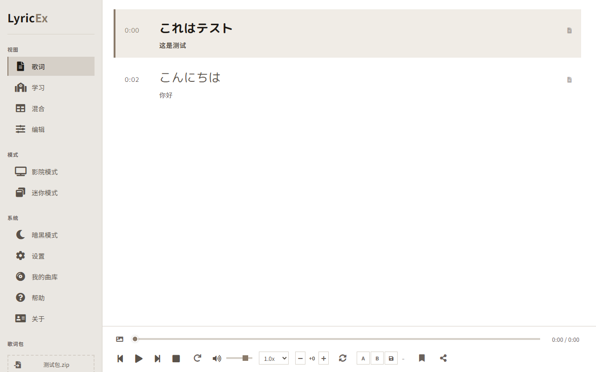
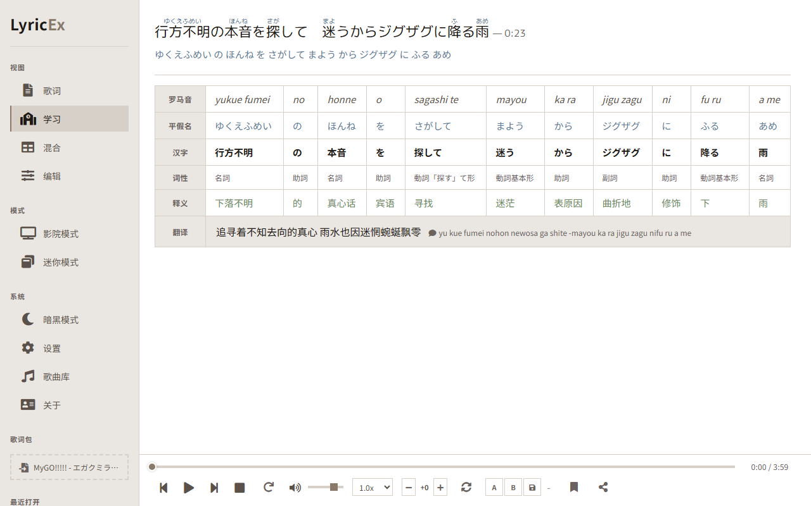
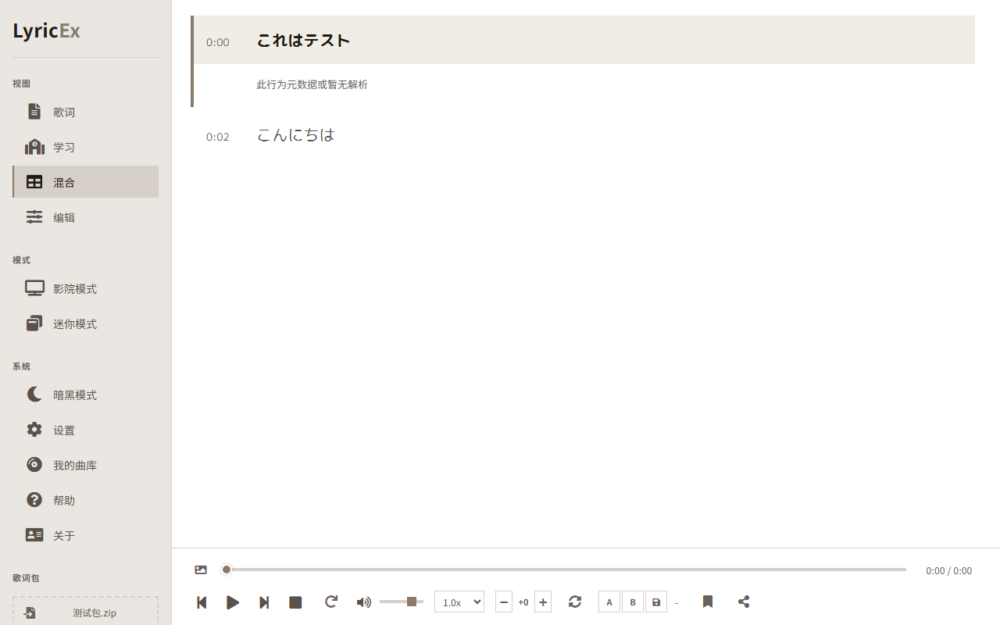
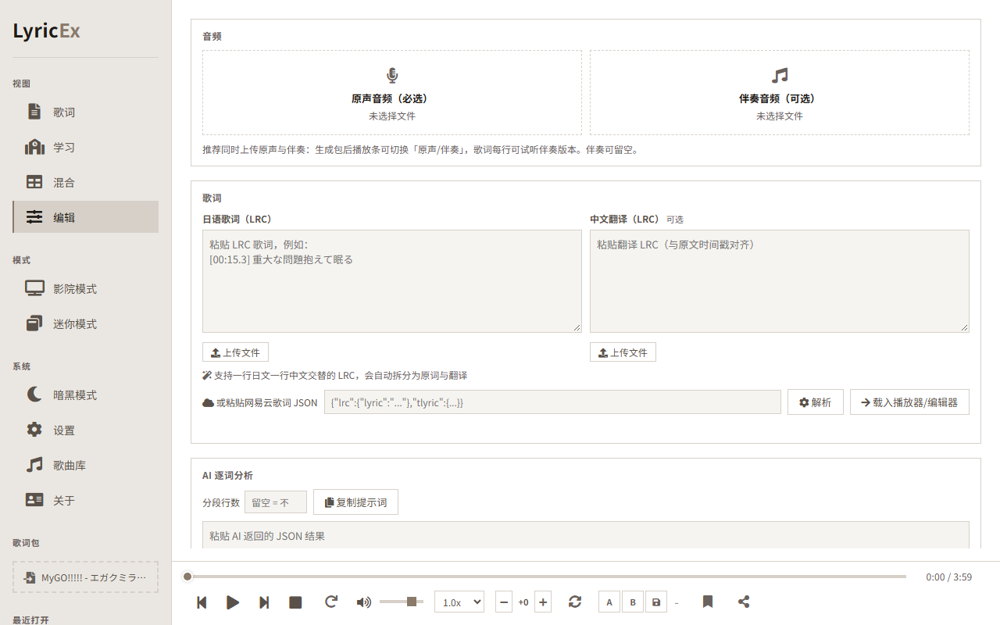

# LyricEx · 歌词鉴赏

[](https://github.com/Rinkio-Lab/LyricEx/actions/workflows/ci.yml)
[](LICENSE)
[](package.json)

[中文](README.zh-CN.md) · [日本語](README.ja.md)

A pure-frontend Japanese lyric study tool. Upload a lyric pack (`.zip` / `.lrc`), then sing along, learn word-by-word, mix study with lyrics, or edit and re-export — all in four views, with karaoke word timing, kanji furigana, per-word analysis, and timeline editing. **Zero runtime dependencies** (fonts / Font Awesome / JSZip are vendored locally) — double-click `index.html` and go.

**Option 1 — Python:**

```bash
python -m http.server 8090
```

**Option 2 — npx:**

```bash
npx serve .
```

**Option 3 — Node (zero-dep, cross-platform):**

```bash
node scripts/serve.mjs
```

## Screenshots

| Lyrics | Study (per-word analysis) |
|---|---|
|  |  |

| Mixed (lyrics + study) | Editor / Pack builder |
|---|---|
|  |  |

## Features

- **Four views** — Lyrics (follow & sing), Study (per-word table: romaji / hiragana / kanji / part-of-speech / meaning), Mixed (both at once), Editor (timeline + export).
- **Word-by-word karaoke** — highlight follows per-word timing carried in the package (enhanced `.lrc` `<mm:ss.xx>` / ASS `\k` import in the editor).
- **AI word analysis** — build a pack, copy a prompt to any LLM, paste the JSON back; strict validation matches it to your lyrics. No API keys, fully static.
- **Pack builder workspace** (v2.6.0) — original audio required, optional instrumental track; paste or upload LRC (alternating JP/CN LRC auto-splits into original + translation); NetEase JSON supported; export a v2.1 pack.
- **Cinema & mini modes**, loop / AB-repeat, speed & transpose, spectrum, share cards, settings backup (export/import JSON).
- **PWA** — installable & offline when served over http(s).

## Quick Start

1. Clone or download the repo, open `index.html` (works from `file://`).
2. Or serve over HTTP for PWA install: `python -m http.server 8090` → visit `http://localhost:8090`.
3. Drop a `.zip` pack or `.lrc` onto the left panel, or upload from the menu.

Building a pack (v2.6.0+): open the **Editor** view → **Build** tab → add audio (vocal required, instrumental optional) → paste/upload LRC → optional AI analysis → **Export pack**. The exported `.lxp.zip` is a standard LyricEx v2 pack (v2.0-compatible).

## Development

```bash
npm test                # full self-check: lib + utils + boot smoke + i18n + lang switch
npm run lint            # ESLint 9 (flat config, safety rules only)
npm run test:cov        # c8 coverage
npm run e2e             # Playwright real-browser smoke + axe a11y (first: npm run e2e:install)
npm run release-check   # CACHE/changelog lockstep + size report + full tests
```

Project structure (abridged):

```text
LyricEx/
├── assets/
│   ├── images/shots/     # README screenshots (scripts/readme-shots.mjs regenerates)
│   ├── locales/          # i18n dicts (zh/ja/en AI-maintained; user langs fallback to en→zh)
│   ├── scripts/
│   │   ├── app.js        # core app state + boot
│   │   ├── lib.js        # pure helpers (LRC parse, settings, package format)
│   │   ├── ui/           # view modules (editor, workspace, settings, …)
│   │   ├── utils/        # pure functions (netease, ai-import, lyric-package, …)
│   │   └── modules/      # audio graph, video export, recent store, …
│   └── styles/
├── examples/             # demo lyric packs (add/remove freely)
├── scripts/              # dev tooling (serve, release-check, readme-shots)
├── tests/                # node self-checks + Playwright e2e
└── vendor/               # vendored third-party (fonts, Font Awesome, JSZip) — no CDN
```

See [FORMAT.md](FORMAT.md) for the package format, [CHANGELOG.md](CHANGELOG.md) for release notes.

## License

MIT — see [LICENSE](LICENSE). This tool plays only audio you provide locally; it does not store or host any media.
