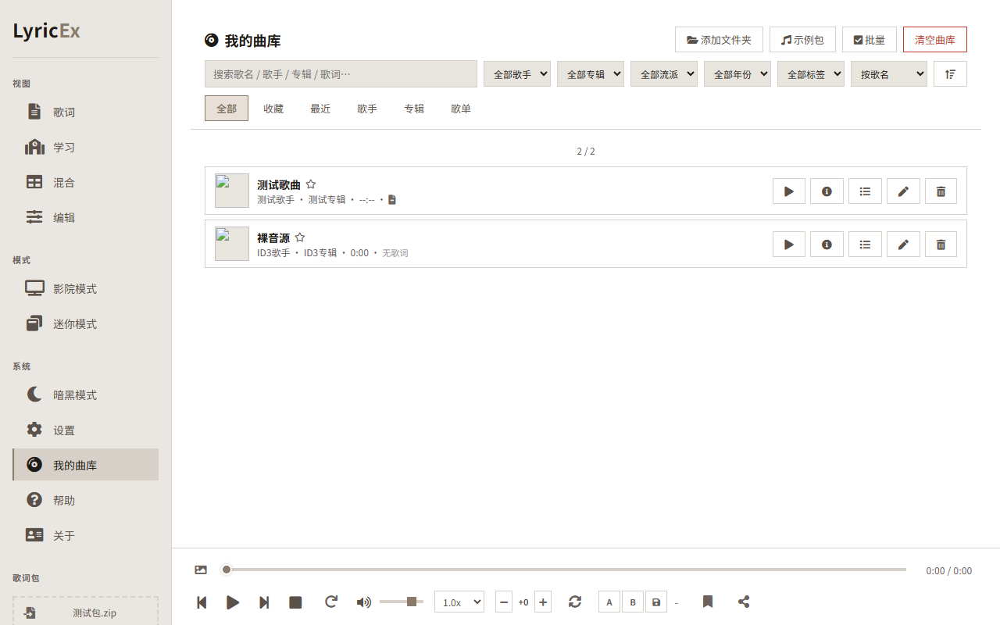
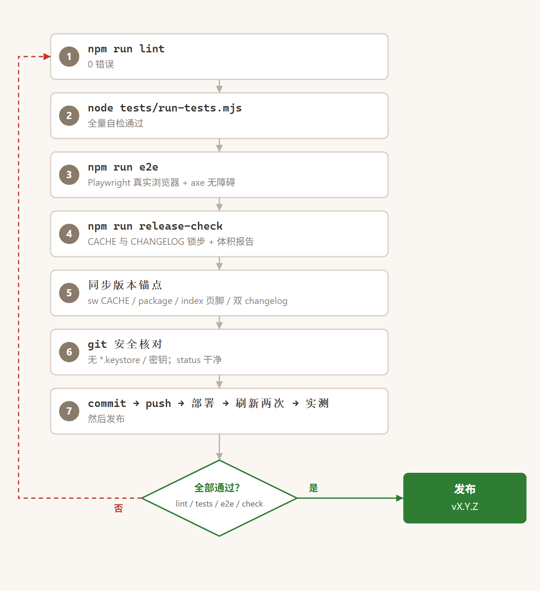

# LyricEx · 歌词鉴赏

[](https://github.com/Rinkio-Lab/LyricEx/actions/workflows/ci.yml)
[](LICENSE)
[](package.json)

[English](README.md) · [日本語](README.ja.md)

纯前端日语歌词鉴赏工具。上传歌词包（`.zip` / `.lrc`），在 **歌词 / 学习 / 混合 / 编辑** 四种视图里跟唱、逐字卡拉OK、汉字注音、逐词解析、时间轴校准与导出。**零运行时依赖**（字体 / Font Awesome / JSZip 已内置在 `vendor/`），双击 `index.html` 即可使用，无需联网。

**方式一：Python**

```bash
python -m http.server 8090
```

**方式二：npx**

```bash
npx serve .
```

**方式三：Node（零依赖、跨平台）**

```bash
node scripts/serve.mjs
```

## 截图

| 歌词视图 | 学习视图（逐词解析） |
|---|---|
|  |  |

| 混合视图（歌词+学习） | 编辑 / 制包工作区 |
|---|---|
|  |  |

| 歌曲库（本地曲库） |
|---|
|  |

## 功能

- **四种视图** — 歌词（跟唱）、学习（逐词表：罗马音 / 平假名 / 汉字 / 词性 / 释义）、混合（两者兼得）、编辑（时间轴 + 导出）。
- **逐字卡拉OK** — 高亮跟随包内逐字时间（编辑器支持增强 `.lrc` `<mm:ss.xx>` / ASS `\k` / `.yrc` `.klyric` 导入；制包页「逐字时间轴」可粘贴外部工具生成的词级时间轴 JSON，平台无逐字收录时可用）。
- **汉字注音与反标注** — 汉字上标假名；开启「反标注」后歌词变纯假名、汉字标在假名上方（初学者友好）。
- **AI 词义分析** — 制包时复制提示词给任意大模型，把 JSON 粘回来；严格校验匹配歌词行。无 API Key，纯静态。
- **制包工作区**（v2.6.0）— 原声音频必选、伴奏可选；粘贴或上传 LRC（交替中日 LRC 自动拆分为原文+翻译）；支持网易云 JSON；导出 v2.1 包。
- **统一导出弹窗**（v3.3.0）— 一个按钮涵盖 LyricEx 包 / 字幕（LRC/ASS/SRT）/ 歌词与学习笔记（TXT/MD/HTML/PDF）/ 视频（mp4）/ 分享卡片 / 竖版海报，全部带实时预览与自定义样式。
- **影院 / 迷你模式**，循环 / AB 复读，变速与变调，频谱，分享卡片，设置备份（JSON 导入导出）。
- **PWA** — 通过 http(s) 访问时可安装并离线使用。

## 快速上手

1. 克隆或下载仓库，打开 `index.html`（`file://` 即可用）。
2. 或通过 HTTP 启动以获得 PWA 安装能力：`python -m http.server 8090` → 访问 `http://localhost:8090`。
3. 把 `.zip` 歌词包或 `.lrc` 拖到左侧面板，或从菜单上传。

制包（v2.6.0+）：打开 **编辑** 视图 → **制包** tab → 添加音频（人声必选、伴奏可选）→ 粘贴 / 上传 LRC → 可选 AI 分析 → **导出包**。导出的 `.lxp.zip` 是标准 LyricEx v2 包（兼容 v2.0）。

## 开发

```bash
npm test                # 全量自检：lib + utils + 启动冒烟 + i18n + 语言切换
npm run lint            # ESLint 9（flat config，仅安全规则）
npm run test:cov        # c8 覆盖率
npm run e2e             # Playwright 真实浏览器冒烟 + axe 无障碍（首次先 npm run e2e:install）
npm run release-check   # CACHE/changelog 一致性 + 体积报告 + 全量测试
```

## 提交 / 推送前流程



1. `npm run lint` — 0 错误。
2. `node tests/run-tests.mjs` — 全量自检（i18n / 启动冒烟 / 语言切换 / utils），ALL PASS。
3. `npm run e2e` — Playwright 真实浏览器冒烟 + axe 无障碍。
4. `npm run release-check` — SW CACHE 与 CHANGELOG 锁步 + 全量测试 + 资源体积报告。
5. 版本锚点五件套同步 bump：`sw.js` CACHE、`package.json`、`package-lock.json`、`index.html` 页脚、`CHANGELOG.md` 头部——并同步应用内更新日志 `assets/scripts/changelog.js`。
6. Git 安全检查：`*.keystore` / 密码 / 密钥绝不入库；提交前先 `git status` 核对。
7. 提交（一个版本一个 commit）、push、部署并刷新两次（SW 缓存优先）、真机验收，再发 Release。

项目结构（精简版）：

```text
LyricEx/
├── assets/
│   ├── images/shots/     # README 截图（scripts/readme-shots.mjs 可重新生成）
│   ├── locales/          # i18n 字典（zh/ja/en 由 AI 维护；用户语言回退 en→zh）
│   ├── scripts/
│   │   ├── app.js        # 核心应用状态 + 启动
│   │   ├── lib.js        # 纯函数（LRC 解析、设置、包格式）
│   │   ├── ui/           # 视图模块（editor、workspace、settings…）
│   │   ├── utils/        # 纯函数（netease、ai-import、lyric-package…）
│   │   └── modules/      # 音频图谱、视频导出、最近打开…
│   └── styles/
├── examples/             # 示例歌词包（可自由增删）
├── scripts/              # 开发工具（serve、release-check、readme-shots）
├── tests/                # Node 自检 + Playwright e2e
└── vendor/               # 内置第三方资源（字体、Font Awesome、JSZip）— 无 CDN
```

包格式见 [FORMAT.md](FORMAT.md)，发布记录见 [CHANGELOG.md](CHANGELOG.md)。

## 许可证

MIT — 见 [LICENSE](LICENSE)。本工具只播放你本地提供的音频，不存储或托管任何媒体。
